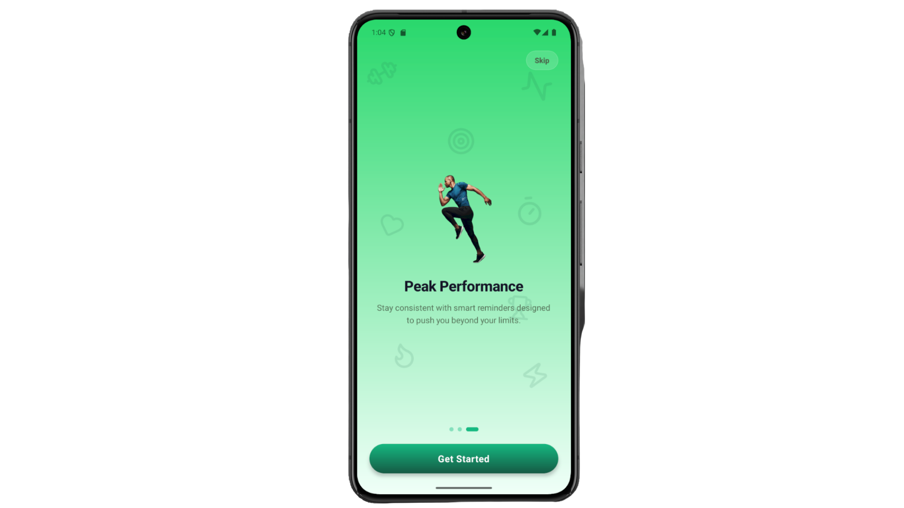
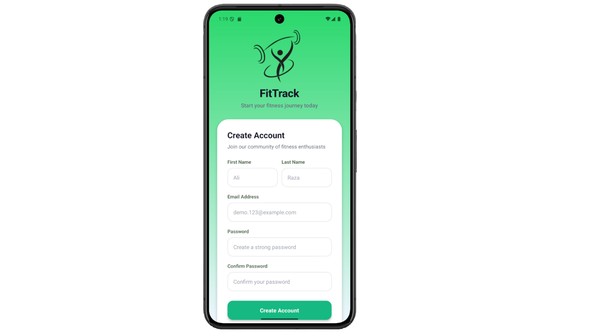
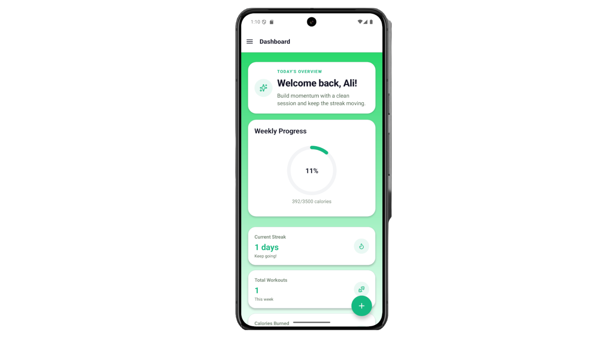
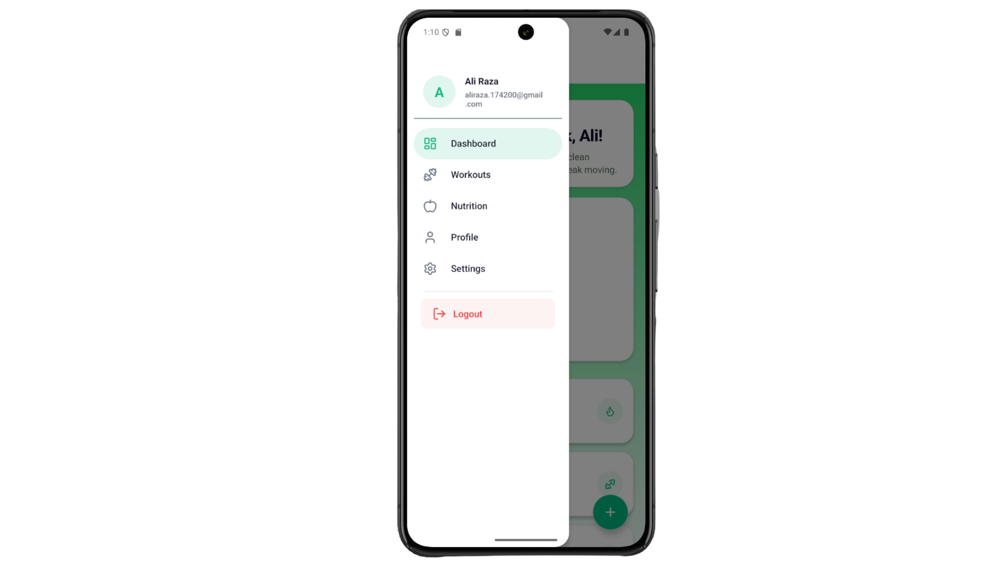
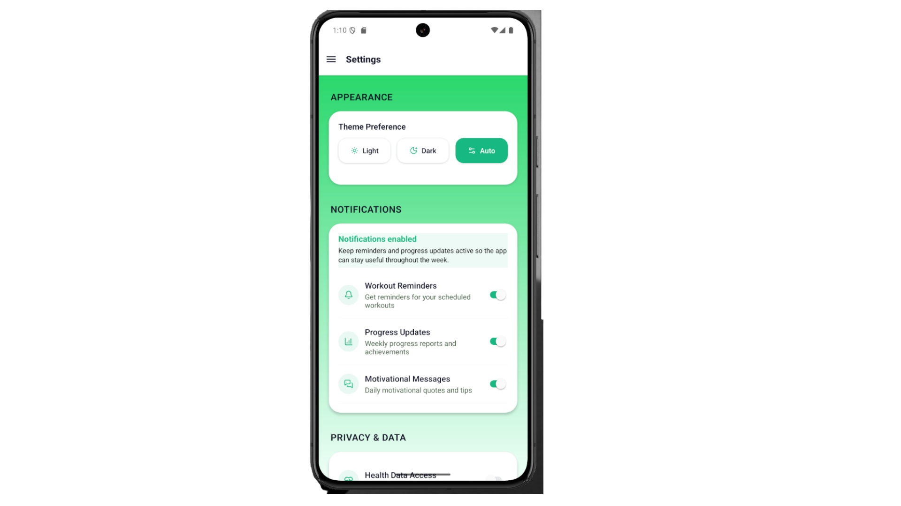
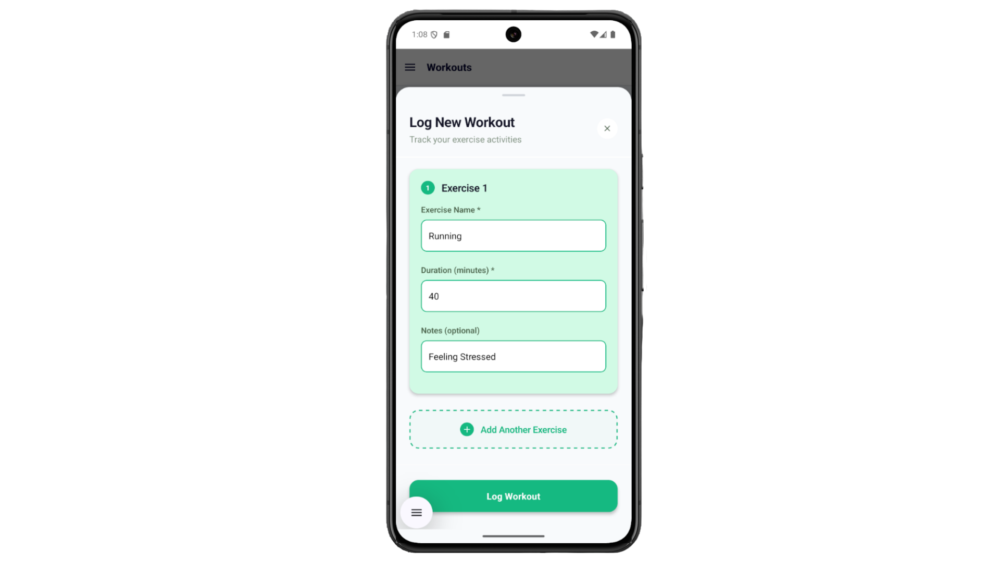
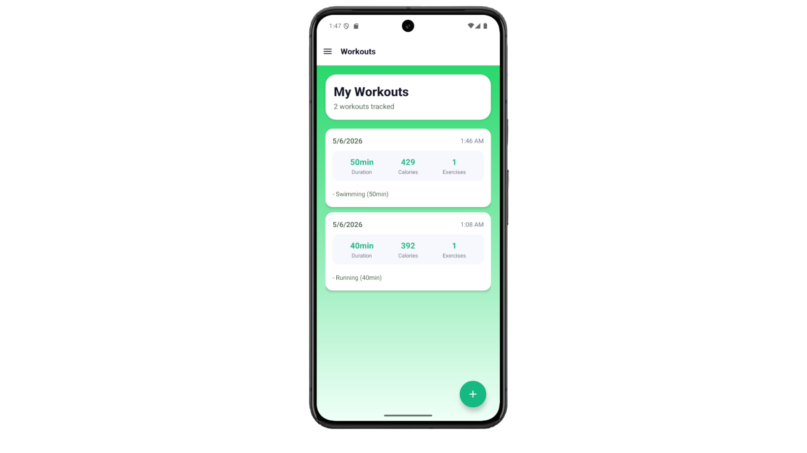
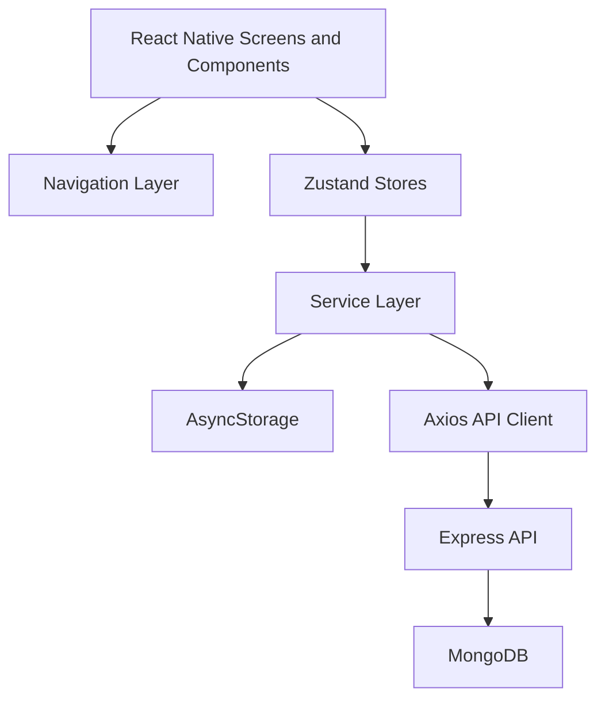

# FitnessTracker

Cross-platform React Native fitness application for workout tracking, nutrition lookup, progress visibility, and personalized fitness management.

## Table of Contents

- [Project Overview](#project-overview)
- [Core Capabilities](#core-capabilities)
- [Application Screens](#application-screens)
- [Architecture](#architecture)
- [Tech Stack](#tech-stack)
- [Repository Structure](#repository-structure)
- [Backend API Overview](#backend-api-overview)
- [Getting Started](#getting-started)
- [Configuration](#configuration)
- [Scripts](#scripts)
- [Testing and Quality](#testing-and-quality)
- [Roadmap](#roadmap)
- [Contributing](#contributing)
- [License](#license)

## Project Overview

FitnessTracker is designed to help users build consistent fitness habits through simple logging, visual progress tracking, and easy profile customization. The app is built with modular boundaries between UI, navigation, business logic, and state stores, making the codebase easier to scale and maintain.

### Product goals

- Provide a clean and intuitive mobile experience for daily fitness tracking.
- Offer secure user authentication with JWT-based backend integration.
- Keep the app usable in local/offline-like scenarios using AsyncStorage-backed state.
- Enable feature growth through modular services and reusable UI components.

### Target use cases

- Users who want to log workout sessions and calories burned.
- Users who want lightweight nutrition lookup support.
- Users who want personal fitness profile tracking (goal, age, height, weight).
- Teams learning or extending a React Native + Zustand + Express architecture.

## Core Capabilities

### 1. Onboarding

- Animated multi-step onboarding flow.
- Introduces users to core app outcomes before sign-in.
- Implemented under `src/screens/onboarding`.

### 2. Authentication (Sign In / Sign Up)

- Frontend auth flows with form validation and UI feedback.
- Zustand-based auth state (`useAuthStore`) for centralized session handling.
- Backend JWT authentication and user profile endpoints via Express + MongoDB.

### 3. Dashboard and Progress

- Summary cards for workout metrics.
- Progress visuals and activity-oriented sections.
- Refreshable dashboard data pipeline.

### 4. Workout Management

- Add and remove workout sessions.
- Exercise-level details with duration and calorie estimation.
- Persisted state via service/store layers.

### 5. Nutrition Support

- Nutrition lookup integration points (`nutritionix` and `openFood` services).
- Structured for future expansion (favorites, meal plans, history).

### 6. Profile and Settings

- Editable profile details (name, physical attributes, goals).
- User preferences and app behavior settings.
- Theme-aware UI through app-level theme context.

### 7. Notifications

- Local notification support for engagement and progress prompts.
- Integration via `@notifee/react-native` and notification services/context.

## Application Screens

Use the following placeholders for product screenshots.

- Onboarding  
  
- Authentication (Sign In / Sign Up)  
  
  
- Dashboard  
  
- Drawer Navigation  
  
- Settings  
  
- Workout form 
  
  


## Architecture

The project follows a layered architecture:

- Presentation: screens + reusable components.
- Navigation: authenticated vs unauthenticated route groups.
- State: global stores using Zustand.
- Domain/services: workout, progress, nutrition, notification logic.
- Data sources: AsyncStorage and optional backend APIs.



## Tech Stack

| Layer | Technology |
|---|---|
| Mobile framework | React Native 0.81 |
| Language | TypeScript |
| Navigation | React Navigation (stack + drawer) |
| State management | Zustand |
| Local persistence | AsyncStorage |
| Networking | Axios |
| Animation/UI | Reanimated, Linear Gradient, SVG, Lucide icons |
| Notifications | Notifee |
| Backend | Node.js + Express |
| Database | MongoDB + Mongoose |
| Auth | JWT + bcrypt |
| Testing | Jest |

## Repository Structure

```text
fitnesstracker/
  App.tsx
  src/
    api/
    components/
    context/
    data/
    hooks/
    navigation/
    screens/
    services/
    store/
    theme/
    types/
    utils/
  backend/
    models/
    routes/
    server.js
```

## Backend API Overview

Base path: `/api/auth`

| Method | Endpoint | Access | Description |
|---|---|---|---|
| POST | `/register` | Public | Register a new user |
| POST | `/login` | Public | Authenticate user and issue JWT |
| GET | `/me` | Private | Get current user profile |
| PUT | `/profile` | Private | Update current user profile |

Authentication header format:

```http
Authorization: Bearer <token>
```

## Getting Started

### Prerequisites

- Node.js 20 or newer
- npm
- React Native environment configured for Android/iOS
- Android Studio (Android development)
- Xcode (iOS development on macOS)
- MongoDB instance (if backend auth is enabled)

### 1. Install mobile dependencies

```bash
npm install
```

### 2. Start Metro

```bash
npm start
```

### 3. Run mobile app

```bash
npm run android
```

```bash
npm run ios
```

### 4. Optional backend setup

```bash
cd backend
npm install
node server.js
```

## Configuration

### Backend environment variables

Create `backend/.env`:

```env
MONGO_URI=your_mongodb_connection_string
JWT_SECRET=your_super_secret_key
NODE_ENV=development
PORT=5000
```

### Mobile API host

The mobile app uses platform-aware API resolution in `src/api/client.ts`:

- Android emulator: `http://10.0.2.2:5000/api`
- iOS simulator: `http://localhost:5000/api`

If testing on a physical device, replace with your machine's reachable LAN IP.

## Scripts

### Root scripts

| Command | Purpose |
|---|---|
| `npm start` | Start Metro bundler |
| `npm run android` | Build and run Android app |
| `npm run ios` | Build and run iOS app |
| `npm run lint` | Run ESLint |
| `npm test` | Run Jest tests |

### Backend commands

| Command | Purpose |
|---|---|
| `node server.js` | Start backend API server |

## Testing and Quality

- Unit testing via Jest (`__tests__/`).
- Linting via ESLint.
- Store-based architecture helps isolate business logic for future test coverage expansion.

Suggested quality pipeline for CI:

1. Install dependencies.
2. Run lint (`npm run lint`).
3. Run tests (`npm test`).
4. Run platform build checks.

## Roadmap

- Add complete workout history filters and analytics.
- Expand nutrition module with meal logging and daily totals.
- Add stronger form-level and API-level validation.
- Introduce e2e testing (Detox/Appium).
- Add release automation and CI/CD workflows.

## Contributing

1. Create a feature branch from `main`.
2. Keep components small and reusable.
3. Keep services focused on business logic.
4. Keep global state in Zustand stores where shared.
5. Open a pull request with clear testing notes.

## License

No license file is currently included. Add a `LICENSE` file if you plan to distribute or open-source the project formally.
